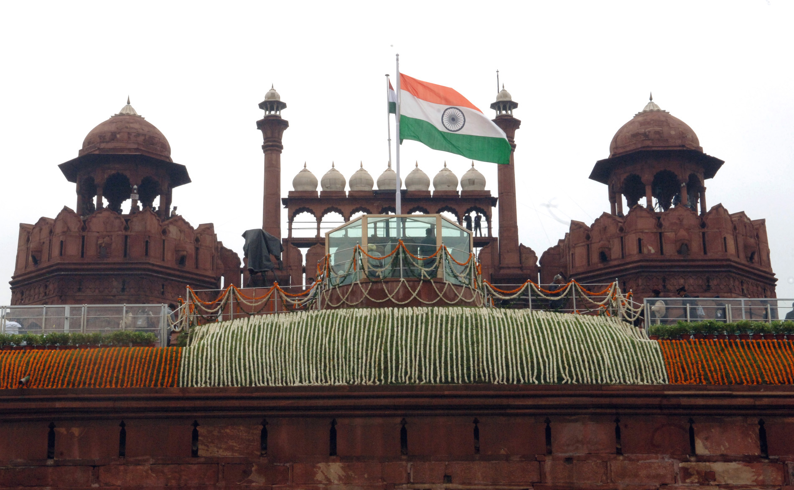

<html lang="en">
  <head>
    <title>meow</title>
    <link rel="stylesheet" href="cyber.css" />
    <link rel="preconnect" href="https://fonts.googleapis.com" />
    <link rel="preconnect" href="https://fonts.gstatic.com" crossorigin />
    <link
      href="https://fonts.googleapis.com/css2?family=Bitcount:wght@100..900&family=Roboto+Mono:ital,wght@0,100..700;1,100..700&display=swap"
      rel="stylesheet"
    />
    <meta charset="UTF-8" />

    <meta name="viewport" content="width=device-width, initial-scale=1.0" />
    <title>Document</title>
  </head>
  <body>
    
    <h1>
      Independence🫡day
    </h1>
    

      Independence Day in India is celebrated every year on 15 August to
      commemorate the nation's freedom from British rule in 1947, a day when
      legislative sovereignty was transferred via the Indian Independence Act
      Wikipedia Encyclopedia Britannica . This milestone marked the end of
      nearly 200 years of colonial domination driven by the British East India
      Company and then the British Crown Encyclopedia Britannica Know India . On
      that historic day, Jawaharlal Nehru—India’s first Prime Minister—raised
      the national flag atop the Lahori Gate of the Red Fort in Delhi, followed
      by his famed "Tryst with Destiny" 
    

    
    

      The day is observed with fervent patriotism across the country. The Prime
      Minister hoists the Tricolor at the Red Fort and addresses the nation,
      while patriotic music, parades, cultural programs, and communal events
      fill the day with unity and festivity Wikipedia +1 . In 2025, India will
      celebrate its 79th Independence Day—a count that starts from the first
      observance in 1947 The Economic Times Jagranjosh.com . Additionally,
      initiatives like ‘Har Ghar Tiranga’ in Uttar Pradesh aim to bring the flag
      into every household, empower local women through self-help groups, and
      reinforce civic pride through grassroots participation
    

<a href="https://en.wikipedia.org/wiki/Independence_Day_(India)"><button>know more</button></a>
  </body>
</html>
